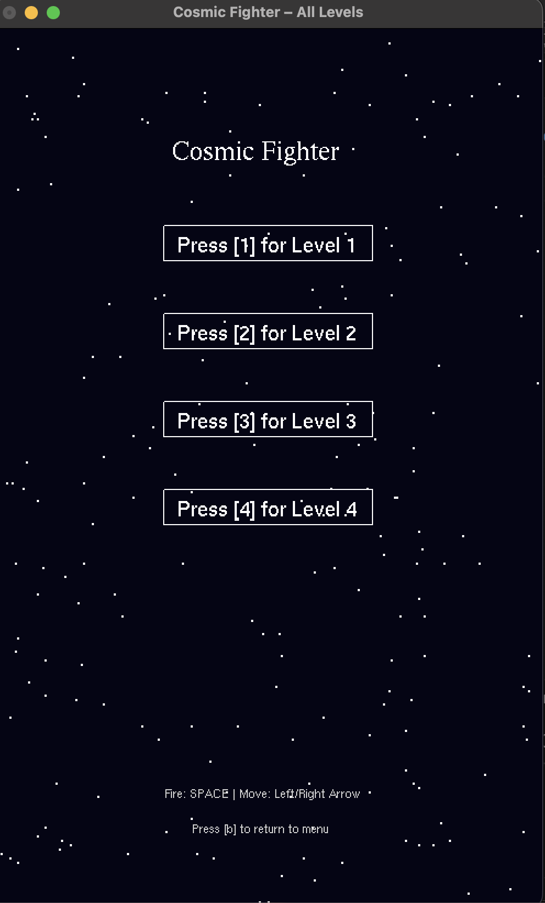
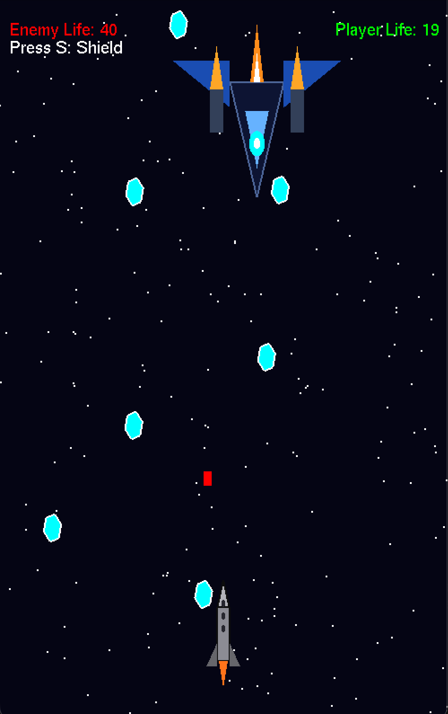
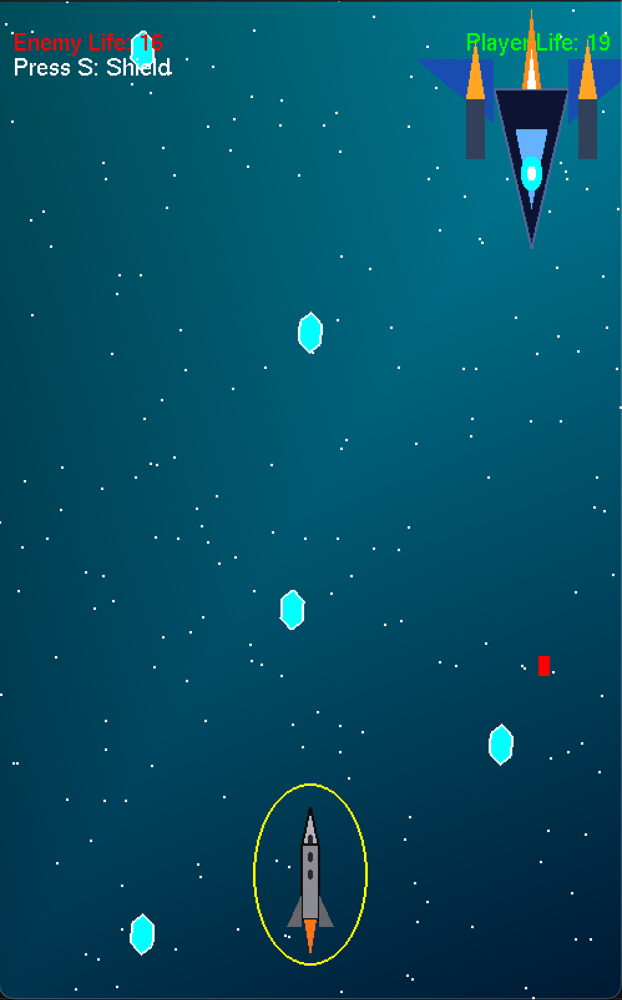

# 🚀 Cosmic Fighter - Level 3 Graphics Project

A 2D space shooter game developed using **C++ and OpenGL (GLUT)** as part of a Level 3 Computer Graphics course.  
The project demonstrates real-time rendering, animation, and game mechanics using OpenGL.

---

## 🎮 Features

- 🧑‍🚀 Player-controlled spaceship movement  
- 👾 Enemy movement system  
- 💥 Bullet shooting mechanics  
- 🎯 Collision detection system  
- 🌌 Animated space background  
- 🛡️ Shield activation power-up  
- ⚡ Smooth real-time rendering using OpenGL  

---

## 🖼️ Screenshots

### Main Menu


### Level 3 Gameplay


### Shield Activation

---

## 🛠️ Tech Stack

- C++
- OpenGL (GLUT / FreeGLUT)
- Graphics Programming
- Game Development Concepts

---

## ▶️ How to Run

### Linux / Mac
```bash
clang++ main.cpp -framework OpenGL -framework GLUT -o rect
./rect

